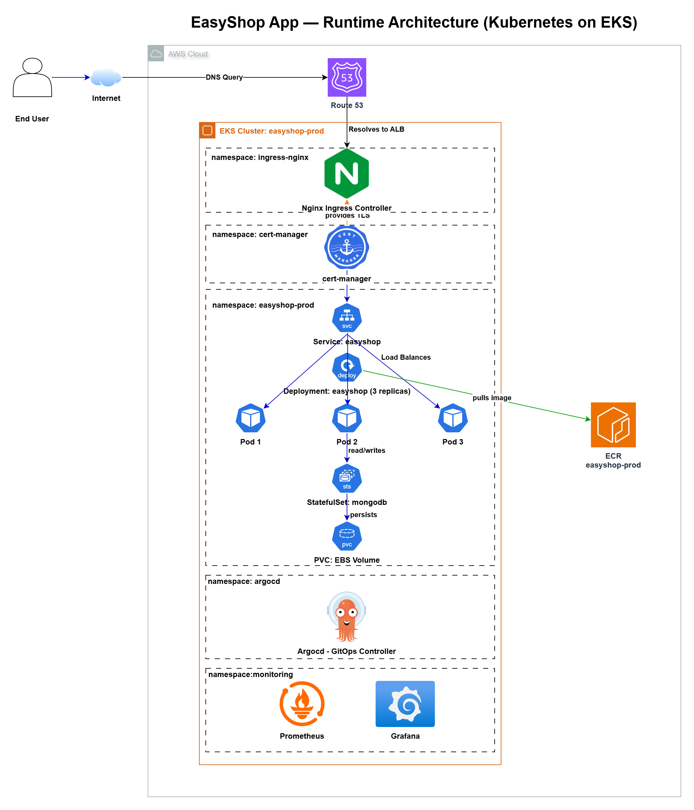
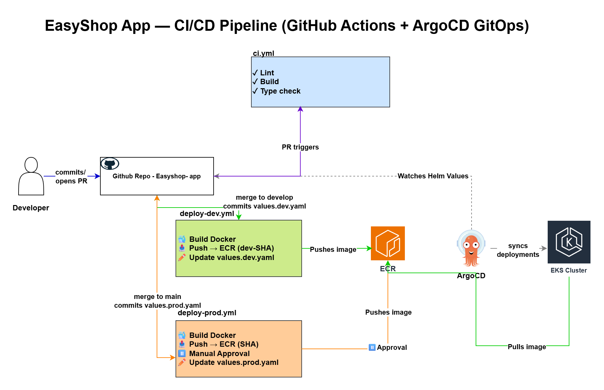

<div align="center">

# 🛒 EasyShop App

**Modern full-stack e-commerce platform on Kubernetes**

Next.js 14 · TypeScript · MongoDB · AWS EKS · GitOps with ArgoCD

[](https://github.com/Siva028/Easyshop-App/actions/workflows/ci.yml)
[](https://github.com/Siva028/Easyshop-App/actions/workflows/deploy-dev.yml)
[](https://github.com/Siva028/Easyshop-App/actions/workflows/deploy-prod.yml)
[](https://nextjs.org/)
[](https://www.typescriptlang.org/)
[](https://www.mongodb.com/)
[](./LICENSE)

</div>

---

## 📐 Architecture

### Runtime — Kubernetes on EKS



Browser traffic resolves through **Route 53 → Nginx Ingress** (TLS terminated by **cert-manager** with Let's Encrypt) into the `easyshop-prod` namespace. The **Service** load-balances across 3 Next.js replicas, which read/write to a **MongoDB StatefulSet** backed by a PVC on EBS (`gp2`). **ArgoCD** continuously reconciles cluster state from the Helm values committed in this repo. **Prometheus + Grafana** scrape both the app (`/metrics` on the `http` port) and MongoDB.

### CI/CD — GitHub Actions + GitOps



| Workflow | Trigger | What it does |
|---|---|---|
| [`ci.yml`](.github/workflows/ci.yml) | PRs to `main` / `develop` | Lint, type-check, build, then Trivy scan of the Docker image (CRITICAL/HIGH, non-blocking) |
| [`deploy-dev.yml`](.github/workflows/deploy-dev.yml) | Push to `develop` | Build & push image to ECR (`dev-<sha>` + `dev-latest`), Trivy scan, then commit updated `values.dev.yaml` back to the repo |
| [`deploy-prod.yml`](.github/workflows/deploy-prod.yml) | Push to `main` | Build & push image to ECR (`<sha-or-tag>` + `latest`), Trivy scan, **manual approval gate** (GitHub `production` environment), then commit updated `values.prod.yaml` |

Once a deploy workflow commits a new image tag into `helm/easyshop/values.<env>.yaml`, **ArgoCD detects the change and auto-syncs** — no `kubectl apply` required.

> Editable diagram source: [`docs/easyshop-app-architecture.drawio`](docs/easyshop-app-architecture.drawio)

---

## ✨ Features

| Feature | Implementation |
|---|---|
| 🔐 Authentication | NextAuth.js with JWT (`jose` + `jsonwebtoken`), `bcryptjs` password hashing |
| 🛡️ Route protection | [`src/middleware.ts`](src/middleware.ts) gates `/checkout`, `/profile`, `/admin`; injects `x-user-id` / `x-user-role` headers |
| 🛍️ Cart & state | Redux Toolkit + React Redux |
| 🔍 Search & filter | Product search, category filtering, pagination |
| 📦 Order lifecycle | Cart → checkout → order history (`/api/orders`) |
| 🌙 Dark mode | `next-themes` with system preference |
| 📱 Responsive | Mobile-first Tailwind CSS + Radix UI primitives |
| 🚀 GitOps delivery | ArgoCD auto-syncs Helm values committed by CI |
| 🔒 HTTPS | cert-manager + Let's Encrypt (HTTP-01 solver via nginx) |
| 📊 Observability | Prometheus ServiceMonitors + Grafana dashboards + alerts |

---

## 🧰 Tech Stack

<div align="center">

| Layer | Technology |
|---|---|
| **Framework** | Next.js 14.1 (App Router, standalone output) |
| **Language** | TypeScript 5 |
| **UI** | Tailwind CSS · Radix UI · Framer Motion · Embla Carousel |
| **State** | Redux Toolkit · React Redux |
| **Forms** | React Hook Form · Zod |
| **Auth** | NextAuth.js · JWT (jose / jsonwebtoken) · bcryptjs |
| **Database** | MongoDB 7 · Mongoose 8 |
| **HTTP** | Axios |
| **Container** | Docker (multi-stage, distroless-style runtime as `nextjs:1001`) |
| **Orchestration** | Kubernetes · Helm 3 · AWS EKS 1.34 |
| **GitOps** | ArgoCD (auto-sync, prune, self-heal) |
| **CI/CD** | GitHub Actions (OIDC to AWS, no static keys) |
| **Registry** | AWS ECR (`ap-south-1`) |
| **Ingress / TLS** | Nginx Ingress Controller · cert-manager · Let's Encrypt |
| **Monitoring** | kube-prometheus-stack · Prometheus · Grafana · AlertManager |

</div>

---

## 🚀 Local Development

### Prerequisites

- [Node.js 22+](https://nodejs.org/) and [Yarn](https://yarnpkg.com/)
- [Docker](https://www.docker.com/) + Docker Compose

### Option 1 — Docker Compose (recommended)

Spins up the app, MongoDB, and Mongo Express UI together.

```bash
git clone https://github.com/Siva028/Easyshop-App.git
cd Easyshop-App

# Start the full stack (app + MongoDB + Mongo Express)
docker compose -f docker-compose.dev.yml up
```

| Service | URL |
|---|---|
| 🛒 App | http://localhost:3000 |
| 🗄️ Mongo Express | http://localhost:8081 |
| 🍃 MongoDB | mongodb://localhost:27017 |

The compose file mounts the source as a volume — hot reload works without restarting containers. Default secrets (`dev-secret-change-in-prod`) are baked in for local dev only.

### Option 2 — Without Docker

```bash
yarn install
yarn dev
```

Requires a running MongoDB instance and a `.env.local` file (see below).

### Seed sample products

```bash
yarn migrate
```

Loads products from [`.db/db.json`](.db/db.json) into MongoDB via [`scripts/migrate-data.ts`](scripts/migrate-data.ts). Default target: `mongodb://easyshop-mongodb:27017/easyshop` (override with `MONGODB_URI` env var).

---

## 🔑 Environment Variables

Create `.env.local` in the project root for local non-Docker runs:

```env
# MongoDB
MONGODB_URI=mongodb://localhost:27017/easyshop

# NextAuth
NEXTAUTH_SECRET=<openssl rand -base64 32>
NEXTAUTH_URL=http://localhost:3000

# JWT
JWT_SECRET=<openssl rand -base64 32>

# Public API base
NEXT_PUBLIC_API_URL=http://localhost:3000/api
```

> ⚠️ In Kubernetes, `NEXTAUTH_SECRET` and `JWT_SECRET` are stored in the K8s `easyshop-secrets` Secret (provisioned by [`argocd/create-secret.sh`](argocd/create-secret.sh)). They are **never** committed to the repo or to Helm values.

---

## 📁 Project Structure

```
Easyshop-App/
├── src/
│   ├── app/                      # Next.js App Router
│   │   ├── (auth)/               # Login & register routes
│   │   ├── api/                  # API route handlers
│   │   │   ├── auth/             # NextAuth provider
│   │   │   ├── cart/             # Cart CRUD
│   │   │   ├── orders/           # Order management
│   │   │   ├── products/         # Product list/create
│   │   │   └── singleProduct/[slug]/
│   │   ├── checkout/             # Checkout flow
│   │   ├── orders/               # Order history
│   │   ├── products/[slug]/      # Product detail
│   │   ├── profile/              # User account
│   │   ├── shops/                # Shop pages
│   │   ├── offers/, contact/
│   │   └── layout.tsx, page.tsx, error.tsx, not-found.tsx, loading.tsx
│   ├── components/               # 30+ components: Navbar, Footer,
│   │   │                         # ProductGrid, SearchBar, Modal, etc.
│   │   ├── cards/, checkout/, filters/, forms/, heros/,
│   │   ├── loader/, profile/, providers/, sidebars/, sliders/, ui/
│   ├── lib/                      # Auth utilities, helpers
│   ├── data/                     # Static data
│   ├── types/                    # TypeScript definitions
│   ├── styles/, assets/
│   └── middleware.ts             # Auth guards + role-based routing
│
├── helm/easyshop/                # Helm chart (v0.1.0)
│   ├── Chart.yaml
│   ├── values.yaml               # Defaults (replicas: 2, ingress nginx, MongoDB enabled)
│   ├── values.dev.yaml           # Dev overrides ← auto-bumped by deploy-dev.yml
│   ├── values.prod.yaml          # Prod overrides ← auto-bumped by deploy-prod.yml
│   └── templates/                # deployment, service, ingress, hpa,
│                                 # mongodb (StatefulSet), namespace, secret, _helpers
│
├── argocd/
│   ├── application.dev.yaml      # ArgoCD App → branch develop, namespace easyshop-dev
│   ├── application.prod.yaml     # ArgoCD App → branch main,    namespace easyshop-prod
│   ├── cluster-issuer.yaml       # cert-manager Let's Encrypt staging + prod issuers
│   ├── install-argocd.sh         # One-shot ArgoCD installer (LoadBalancer service)
│   ├── create-secret.sh          # Generates K8s Secret with NEXTAUTH_SECRET / JWT_SECRET
│   └── verify-deploy.sh          # Health check across pods, svc, ingress, MongoDB
│
├── monitoring/
│   ├── install.sh                # Helm install kube-prometheus-stack
│   ├── values.dev.yaml           # Lightweight: Prometheus 3d retention, no PV
│   ├── values.prod.yaml          # Full: 15d retention + 20Gi PV, Slack AlertManager
│   ├── servicemonitor.yaml       # Scrapes easyshop + MongoDB across both namespaces
│   └── alerts.yaml               # 5 PrometheusRule alerts (crash loop, no pods,
│                                 # high mem/cpu, MongoDB down)
│
├── scripts/
│   ├── migrate-data.ts           # Mongoose seed script (.db/db.json → MongoDB)
│   ├── Dockerfile.migration      # Container for running the migration as a Job
│   └── tsconfig.json
│
├── .db/                          # Seed data (db.json, routes.json)
├── public/                       # Static assets
├── docs/                         # Architecture diagrams (PNG + .drawio source)
│
├── .github/workflows/            # ci.yml · deploy-dev.yml · deploy-prod.yml
│
├── Dockerfile                    # Multi-stage prod build → standalone Next.js
├── Dockerfile.dev                # Dev image (hot reload via volume mount)
└── docker-compose.dev.yml        # Local: app + MongoDB + Mongo Express
```

---

## 🔌 API Endpoints

| Method | Endpoint | Purpose |
|---|---|---|
| `GET / POST` | `/api/auth/[...nextauth]` | NextAuth handlers |
| `GET / POST` | `/api/products` | List / create products |
| `GET` | `/api/singleProduct/[slug]` | Product detail by slug |
| `GET / POST / DELETE` | `/api/cart` | Cart operations |
| `GET / POST` | `/api/orders` | Orders |
| `GET` | `/api/health` | Liveness probe (used by Docker `HEALTHCHECK`) |

---

## 🐋 Docker

### Production image (multi-stage)

Three stages on `node:22-alpine`:

```
deps     → Yarn install (frozen lockfile)        ← cached layer
builder  → next build (output: standalone)
runner   → minimal runtime, non-root nextjs:1001
           HEALTHCHECK → wget /api/health
           EXPOSE 3000
           CMD node server.js
```

```bash
docker build -t easyshop-app .
docker run -p 3000:3000 easyshop-app
```

### Development image

```bash
docker build -f Dockerfile.dev -t easyshop-dev .
docker run -p 3000:3000 -v $(pwd):/app easyshop-dev
```

---

## ☸️ Kubernetes Deployment

The Helm chart [`helm/easyshop`](helm/easyshop) provisions:

- A `Deployment` of the Next.js app (replicas configurable per env)
- An optional `HorizontalPodAutoscaler` (enabled in prod: 3–10 replicas, target 65% CPU)
- A `Service` (ClusterIP, port 80 → 3000)
- An `Ingress` with TLS (cert-manager `letsencrypt-prod` issuer)
- A MongoDB `StatefulSet` with PVC (2 Gi dev / 20 Gi prod)
- A `Secret` for `NEXTAUTH_SECRET` + `JWT_SECRET`

### Environment differences

| Setting | Dev | Prod |
|---|---|---|
| Replica count | 1 | 3 (HPA 3–10) |
| Image repo | `…/easyshop-dev` | `…/easyshop-prod` |
| Image tag pattern | `dev-<sha>` | `<sha>` (or git tag) |
| Ingress host | `dev.easyshop.yourdomain.com` | `easyshop.yourdomain.com` |
| MongoDB storage | 2 Gi gp2 | 20 Gi gp2 |
| App resources | 100 m / 128 Mi | 500 m / 512 Mi |
| Autoscaling | disabled | enabled |

### One-time cluster setup

```bash
# 1. Install ArgoCD (creates namespace, exposes via LoadBalancer)
bash argocd/install-argocd.sh

# 2. Apply cert-manager ClusterIssuers (Let's Encrypt staging + prod)
kubectl apply -f argocd/cluster-issuer.yaml

# 3. Create per-env secrets (interactive: dev or prod)
bash argocd/create-secret.sh dev
bash argocd/create-secret.sh prod

# 4. Register the ArgoCD Applications
kubectl apply -f argocd/application.dev.yaml
kubectl apply -f argocd/application.prod.yaml

# 5. Verify
bash argocd/verify-deploy.sh dev
```

### Manual Helm deploy (bypass ArgoCD)

```bash
helm upgrade --install easyshop ./helm/easyshop \
  -f helm/easyshop/values.prod.yaml \
  --namespace easyshop-prod
```

---

## 📊 Monitoring

[`monitoring/install.sh`](monitoring/install.sh) installs `kube-prometheus-stack` into the `monitoring` namespace using env-specific overrides.

| | Dev | Prod |
|---|---|---|
| Prometheus retention | 3 days | 15 days |
| Prometheus storage | none (emptyDir) | 20 Gi gp2 |
| Grafana storage | none | 10 Gi gp2 |
| Grafana service | ClusterIP | LoadBalancer |
| AlertManager | disabled | Slack-integrated |

Metrics are scraped from:
- The `easyshop` Service (port `http`, path `/metrics`)
- The `mongodb` Service (port `metrics`)

across both `easyshop-dev` and `easyshop-prod` namespaces, configured in [`monitoring/servicemonitor.yaml`](monitoring/servicemonitor.yaml).

[`monitoring/alerts.yaml`](monitoring/alerts.yaml) defines five PrometheusRules:

| Alert | Severity | Condition |
|---|---|---|
| `EasyShopPodCrashLooping` | Critical | Restart rate > 1/min for 5m |
| `EasyShopNoPods` | Critical | Zero available replicas |
| `EasyShopHighMemory` | Warning | Container memory > 450 Mi for 10m |
| `EasyShopHighCPU` | Warning | CPU > 80% for 10m |
| `MongoDBDown` | Critical | MongoDB pod not ready for 2m |

---

## 🏗️ Infrastructure

The AWS infrastructure (VPC, EKS cluster, ECR repositories, GitHub Actions OIDC roles) is managed in a separate Terraform repository:

**👉 [Easyshop-Infrastructure](https://github.com/Siva028/Easyshop-Infrastructure)**

That repo provisions:
- VPC with public/private subnets across 2 AZs (dev) and 3 AZs (prod)
- EKS 1.34 cluster with managed node groups
- ECR repositories with lifecycle policies (`easyshop-dev`, `easyshop-prod`)
- GitHub Actions OIDC trust relationships (no long-lived AWS keys)

---

## 🔒 Production Gates

- **Manual approval** is required before any prod deployment via the `production` GitHub Environment in [`deploy-prod.yml`](.github/workflows/deploy-prod.yml). Configure reviewers under *Repo Settings → Environments → production*.
- **Trivy** scans every built image for `CRITICAL` and `HIGH` CVEs (`exit-code: 0` — surfaces issues without blocking the pipeline).
- **TLS enforced** end-to-end via cert-manager + Let's Encrypt.
- **Non-root container** runtime (UID 1001) with a Docker `HEALTHCHECK`.

---

## 🤝 Contributing

1. Fork the repository
2. Create a feature branch off `develop`: `git checkout -b feature/your-feature`
3. Commit using conventional messages: `git commit -m 'feat: add your feature'`
4. Push: `git push origin feature/your-feature`
5. Open a Pull Request targeting `develop`

Every PR runs `ci.yml` — lint, type-check, build, and a Trivy scan. PRs to `main` go through the same checks plus the production approval gate before deploy.

---

## 📄 License

[MIT](./LICENSE) © 2025 Md. Afzal Hassan Ehsani

---

## 🔗 Related Repositories

- **[Easyshop-Infrastructure](https://github.com/Siva028/Easyshop-Infrastructure)** — Terraform IaC for the AWS infrastructure that runs this app.
